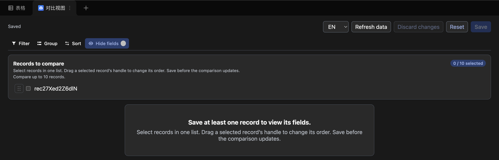

# Lark Base Compare View

Chinese version: [README.zh-CN.md](README.zh-CN.md).

Compare View is a Feishu/Lark Base Data Table View Extension for side-by-side
record comparison. It never changes Base business records, fields, or native
view settings. Instead, it renders selected records as columns and fields as
rows:

| Field | Record A | Record B |
| --- | --- | --- |
| CPU | M4 | M4 Pro |
| Memory | 16 GB | 24 GB |

The UI supports Chinese and English, Feishu light/dark appearance, a sticky
field column, horizontal scrolling, safe display fallbacks for complex values,
and these staged comparison controls:

- Reach every control from one compact toolbar: records, fields, filter, group,
  sort, row height, and the save actions.
- Select one or more records without a plugin-defined count limit from one
  candidate list in the records popover. Checking
  records keeps candidate order stable and appends comparison columns in selection
  order. Drag comparison headers to reorder columns, then save to apply.
- Filter, sort, group, and choose visible fields locally in the extension. They
  never alter the native table view.
- See how many fields differ across the compared records, mark those rows, and
  narrow the matrix to them with the differences-only filter.
- Reorder visible and hidden fields together in the Fields popover and set
  wrapping per field; save to share these settings. Drag the handle or use
  Alt + Up/Down. Reset field order restores the adapter order.
- Switch between four minimum row heights. Expand clipped text inline across
  its field row, then collapse it; this temporary reading action also works
  for read-only users and does not require saving.
- Resize the field column and each record column independently; widths update
  immediately and share automatically after dragging. Failed shares retain the
  local width with retry and restore actions. Other controls remain drafts.
- View one attachment image in a 240px-high area, switch images in the cell or
  read-only gallery, and keep unavailable images and other files readable by name.
- Save to apply record and field drafts. Column widths share separately and
  never submit those drafts.
- Share saved extension configuration through the official bridge data store.
  This is the only write operation and never writes Base business data.
- Open an existing Compare View in the Feishu mobile app to inspect the last
  configuration saved on the web. Mobile is intentionally view-only for now;
  create the view and edit its configuration on the web or desktop client.

## Interface example

English interface in dark appearance:



## Security

This public repository intentionally contains no Feishu deployment binding or
secret. Copy the example files locally and keep the real files untracked:

```sh
cp app.json.example app.json
cp compare-view/block.json.example compare-view/block.json
```

Fill in App ID, BlockTypeID, and a debug Base URL in those local files. Do not
put an App Secret in this project; rotate any value that has been exposed.

## Development

1. Create a Feishu enterprise custom app with the **Bitable Extension → Data
   Table View** capability.
2. Use the official CLI to log in: `opdev login` and choose `Feishu`.
3. Create the two local configuration files above.
4. Install and run the extension:

   ```sh
   cd compare-view
   npm ci
   npm run start
   ```

`npm ci` recreates the dependency tree from the lockfile. The official CLI
restores an embedded runtime during its lifecycle scripts, so do not pass
`--ignore-scripts`. `compare-view/.npmrc` serializes those scripts, and
`npm run start` verifies the required runtime before starting Webpack.

The development server ignores `node_modules` and polls for source changes once
per second. This avoids native watcher `EMFILE` failures in large dependency
trees; hot rebuilds can take up to about one second to begin.

For the MVP, request only the least Feishu Base permission needed for the read
APIs used by the extension, plus Base edit permission for users who should save
the shared extension configuration. Verify exact current permissions in the
Feishu console before publishing.

## Checks

```sh
cd compare-view
npm run typecheck
npm run check:mobile-config
npm run check:attachments
npm run build
```

## Contribution workflow

Start from current `main`, create a focused `<type>/<short-description>`
branch, stage explicit files, and inspect the diff and ignored configuration.
Push that branch and open a draft pull request; direct pushes to `main` are not
part of this project’s workflow. See [docs/DEVELOPMENT.md](docs/DEVELOPMENT.md)
for host checks and the full PR handoff.

`npm run upload` remains available from the official template but is outside
this MVP's release scope.

## License

[MIT](LICENSE) © 2026 yesn0w.
