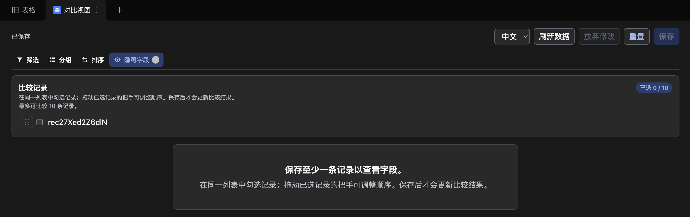

# Lark Base Compare View

英文版本：[README.md](README.md)。

Compare View 是一个用于并排比较记录的飞书/Lark 多维表格数据表视图插件。它绝不会修改多维表格的业务记录、字段或原生视图设置，而是将选中的记录作为列、字段作为行进行渲染：

| 字段 | 记录 A | 记录 B |
| --- | --- | --- |
| CPU | M4 | M4 Pro |
| 内存 | 16 GB | 24 GB |

界面支持中英文、飞书浅色/深色外观、固定字段列、横向滚动以及复杂值的安全显示降级，并提供以下先暂存、后保存的比较控制：

- 在同一个候选列表中选择 1–10 条记录。已选行的复选框前有类似飞书原生样式的拖动把手，可拖动调整显示顺序。
- 在插件内本地进行筛选、排序、分组和字段显示控制，不会修改原生数据表视图。
- 点击保存后才应用草稿；保存成功前，比较矩阵始终展示上一次已保存的配置。
- 通过官方 Bridge 数据存储共享已保存的插件配置。这是唯一的写操作，绝不会写入多维表格业务数据。

## 界面示例

深色外观下的中文界面：



## 安全

此公开仓库不会包含飞书部署绑定信息或密钥。请在本地复制示例文件，并保持真实文件不被 Git 跟踪：

```sh
cp app.json.example app.json
cp compare-view/block.json.example compare-view/block.json
```

在这些本地文件中填写 App ID、BlockTypeID 和调试 Base URL。请不要将 App Secret 写入本项目；如任何值曾被暴露，请先在飞书开发者后台轮换。

## 开发

1. 创建具有 **Bitable Extension → Data Table View** 能力的飞书企业自建应用。
2. 使用官方 CLI 登录：`opdev login`，并选择 `Feishu`。
3. 创建上述两个本地配置文件。
4. 安装并运行插件：

   ```sh
   cd compare-view
   npm ci
   npm run start
   ```

`npm ci` 会按锁文件重新创建依赖树。官方 CLI 会在生命周期脚本中恢复嵌入式运行时，因此请勿传入 `--ignore-scripts`。`compare-view/.npmrc` 会串行执行这些脚本，且 `npm run start` 会在启动 Webpack 前验证所需运行时。

开发服务器会忽略 `node_modules`，并每秒轮询一次源码变更。这可避免大型依赖树中的原生监视器 `EMFILE` 错误；热重编译开始前最多可能有约一秒延迟。

对于 MVP，请申请插件读取 API 所需的最小飞书多维表格权限；需要保存共享插件配置的用户还需要 Base 编辑权限。发布前请在飞书控制台中核对当前的精确权限要求。

## 检查

```sh
cd compare-view
npm run typecheck
npm run build
```

## 贡献工作流

从最新 `main` 开始，创建聚焦的 `<type>/<short-description>` 分支，只暂存明确文件，并检查 diff 与被忽略的配置。推送该分支后创建草稿 Pull Request；本项目工作流不允许直接向 `main` 推送。请参阅 [docs/DEVELOPMENT.zh-CN.md](docs/DEVELOPMENT.zh-CN.md) 了解宿主检查和完整 PR 交接流程。

官方模板保留了 `npm run upload`，但该命令不属于本 MVP 的发布范围。

## 许可证

[MIT](LICENSE) © 2026 yesn0w。
